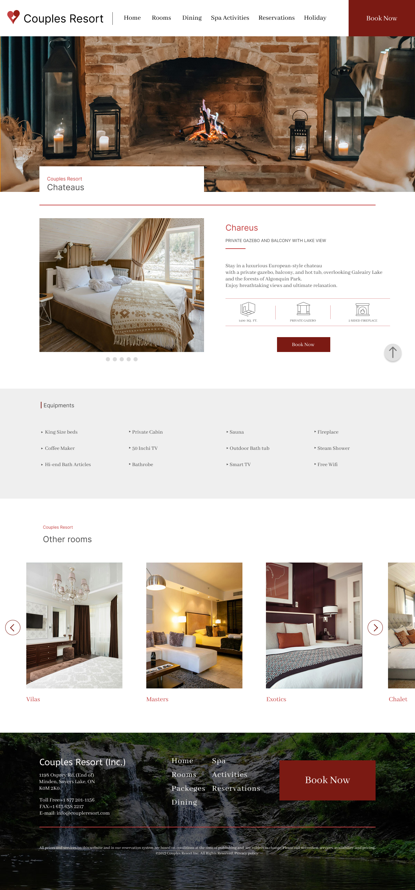

# Morito Rin FIP

**1051 Design & Image / 1053 Visual Communication**
- Redesign Couples Resort web page
- design 3 mobile and 3 correspond desktop pages
- Design wireframes with color, font, images, etc.
- Add 10 prototypes for both mobile and desltop pages in total

**1052 Multi-Media Production**
- build 3 mobile pages and 1 desktop page for Couples Resort based on wireframes
(desktop page should based on original page and design)
- Use Css grid system to style
- Use proper document outline

**1054 Multimedia authoring**
- build 3 mobile pages and 1 desktop page for Couples Resort based on wireframes
(desktop page should based on original page and design)
- Use the ::after pseudo selector to add a graphic element indicating completion (check, thumbs up, etc) on one of the pages.
- Create a simple CSS animation for a submit button on one of the pages
- Implement show/hide functionality based on the hamburger menu or using the `detail` and `summary` elements

## Installation
**Design**
1. Choose 3 pages that I will redesign from Couples Resort
2. Duplicate class build homepage wireframe and create wireframe for other pages
3. Since finished mobile page wireframe, Duplicate it and adjust for desktop page size
4. Add color and images in wireframes
5. Add prototype for mobile and desktop pages

**Coding**
1. Create a mew repo in GitHub
2. Create a new branch
3. Create folder structure 
4. Add contents to html and style it with css

## Usage
Website for Couples Resort

## Contributing

1. Fork it!
2. Create your feature branch: `git checkout -b my-new-feature`
3. Commit your changes: `git commit -am 'Add some feature'`
4. Push to the branch: `git push origin my-new-feature`
5. Submit a pull request :D

## History

- Create basic folder structure
- Update class build homepage with html and CSS
- Use grid system, add animation, ::after psuedo elements, show/hide function

## Credits

Morito Rin

## License

MIT License